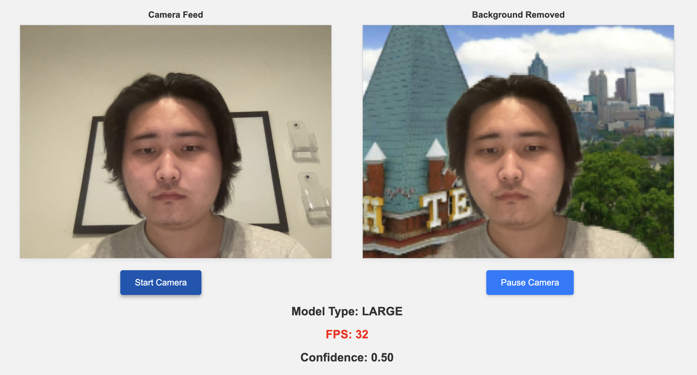
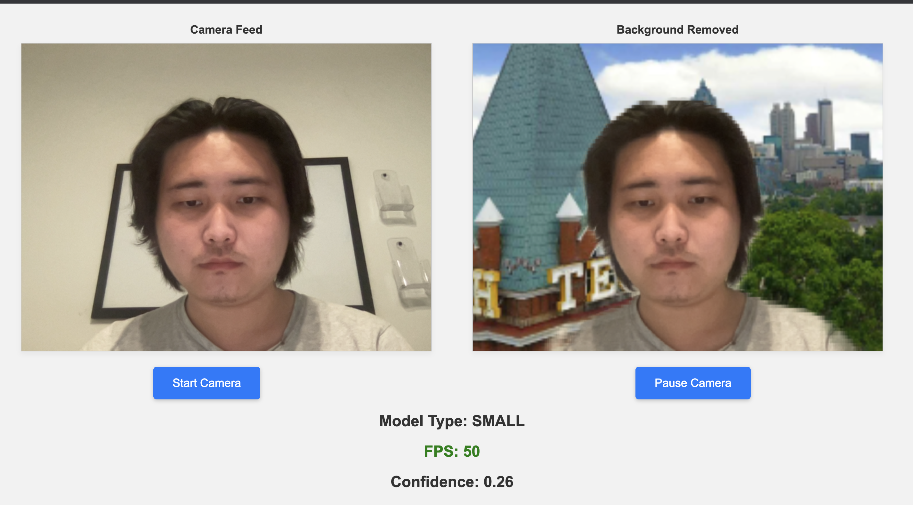

# BuzzSteam Adaptive Demo

This is a demo of the BuzzStream application. It will accept camera feed and remove the background from the video feed. Notably, the application will detect the current FPS and automatically switch to a smaller model if the FPS drops below a certain threshold. Beyond that, the application will also automatically switch back to a larger model if it is confident that the FPS will be high enough.

## Getting Started
To setup and run the demo, make sure you have `npm` installed. Then, run the following commands:
```bash
npm install
npm run dev
```
Then, go to `localhost:8866` in your browser. You need to allow the browser to access your camera feed for the model to load. After the model loads successfully, you should click on "start camera" to start the video feed with the background removed.

## Demo
The demo is currently hosted at [https://cs6235-project.vercel.app/](https://cs6235-project.vercel.app/). You need to allow the browser to access your camera feed for the model to load. After the model loads successfully, you should click on "start camera" to start the video feed with the background removed. You will notice that the model will automatically switch to a smaller model if the FPS drops below a certain threshold. Beyond that, the application will also automatically switch back to a larger model if it is confident that the FPS will be high enough.



**Figure 1: Large Model, FPS is low**


**Figure 2: automatically switched to Small Model, FPS is high, sacrificing accuracy**