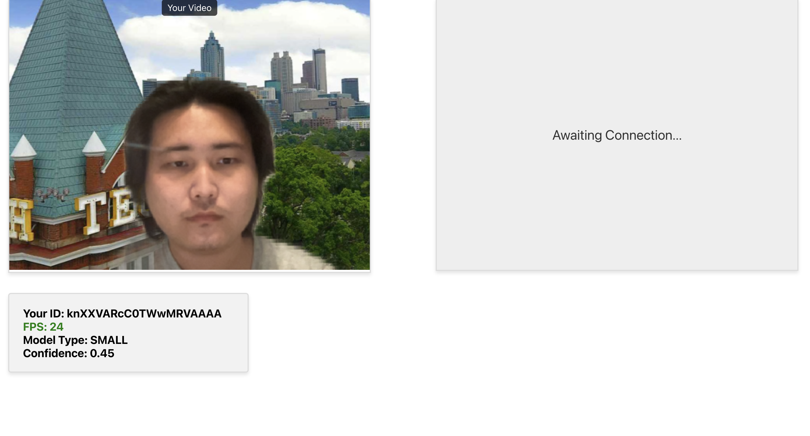
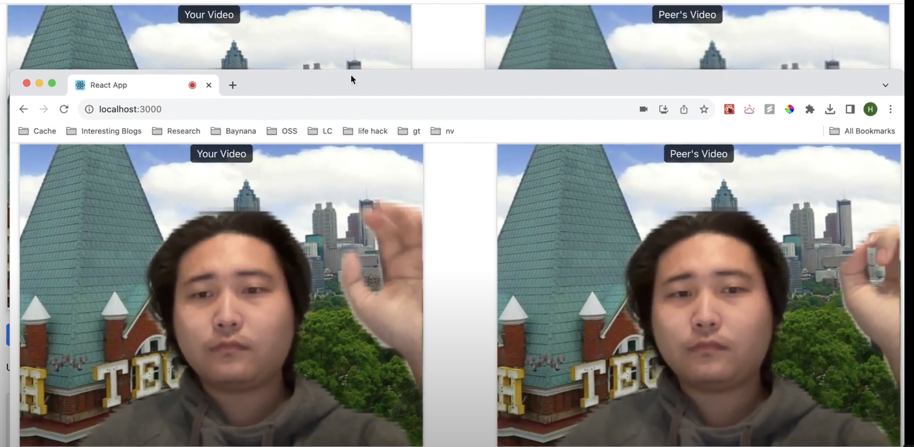

# BuzzStream Demo Video Chat

BuzzStream Demo Video Chat allows users to video chat with each other while removing the background from the video feed. Notably, the application will detect the current FPS and automatically switch to a smaller model if the FPS drops below a certain threshold. Beyond that, the application will also automatically switch back to a larger model if it is confident that the FPS will be high enough.

The application has two parts, the client and the server. The client is a React application that uses the webcam to capture video and sends it to each other via WebRTC. The client also removes background using our inference engine `buzzstream/humanseg`. The server is a Node.js application that manages user states.

## Getting Started
To set up and run the demo, make sure you have `npm` installed. Then, run the following commands:
For the client:
```bash
cd client
npm install
npm run start
```

The client will be running at `localhost:3000`.

For the server:
```bash
cd server
npm install
node server.js
```

The server will be running at `localhost:8000`.

## Demo
After starting the client and the server, you can go to `localhost:3000` in your browser. You need to allow the browser to access your camera feed for the model to load. After the model loads successfully, you should be able to see your background removed video feed on the left hand side. You can also see the video feed of other users on the right hand side. Currently, the right hand side is still waiting for connection from other users. 

You can open another browser window and go to `localhost:3000` to "call" yourself in the other window. Now, going back to the first window, you should be able to see the video feed of the second window on the right hand side. You can also see the video feed of the first window on the second window.

You will notice that the model will automatically switch to a smaller model if the FPS drops below a certain threshold. Beyond that, the application will also automatically switch back to a larger model if it is confident that the FPS will be high enough.


**Figure 1: Waiting for connection**


**Figure 2: Connected**